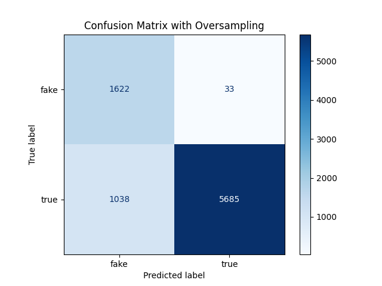

# 🧠 Fake News Detector Web App

This is a simple web application that classifies news articles as **Real** or **Fake** using a machine learning model trained on a news dataset. The app is built with **FastAPI** for the backend and a fun **pixel-art style** frontend using **HTML/CSS**.

## 🚀 Demo

Users can input a news **title** and **content**, then click the **Predict** button to check if the news is real or fake.

<p align="center">
  
</p>

---

## 📁 Project Structure

```
Tweet_Spam/
│
├── app/
│   ├── main.py                    # FastAPI app entry point
│   ├── static/                    # Static files (CSS, background gifs)
│   │   ├── styles.css
│   │   ├── bg.gif / bg2.gif / bg3.gif
│   ├── templates/
│   │   └── index.html             # HTML frontend
│
├── dataset/                       # Dataset files
│   ├── train.csv
│   ├── test.csv
│   └── valid.csv
│
├── model/
│   └── fake_news_classifier.pkl   # Trained RandomForest model
│
├── scripts/
│   ├── train_model.py             # Model training script
│
│── Figure_1.png               # Confusion matrix
│── rp.png               # Classification report
│── demo.gif              #demo
```

---

## 🧩 Model Performance

### Confusion Matrix

<p align="center">
  
</p>

- **True Positives (Real predicted as Real)**: 5685  
- **True Negatives (Fake predicted as Fake)**: 1622  
- **False Positives (Fake predicted as Real)**: 33  
- **False Negatives (Real predicted as Fake)**: 1038

---

### Classification Report

| Class        | Precision | Recall | F1-Score | Support |
|--------------|-----------|--------|----------|---------|
| fake         | 0.61      | 0.98   | 0.75     | 1655    |
| true         | 0.99      | 0.84   | 0.91     | 6723    |
| Accuracy     |           |        | 0.87     | 8378    |
| Macro Avg    | 0.80      | 0.91   | 0.83     | 8378    |
| Weighted Avg | 0.92      | 0.87   | 0.88     | 8378    |

- **Accuracy**: 87%
- **F1-score (Fake)**: 0.75  
- **F1-score (Real)**: 0.91  
- The model performs especially well in identifying **real news**, and oversampling helps improve **recall** for fake news.

---

## 🛠️ Tech Stack

- **Python**
- **FastAPI**
- **Pandas, Joblib, Scikit-learn**
- **HTML/CSS (pixel-art theme)**

---

## 📦 How to Run

1. Clone the repository:

```bash
git clone https://github.com/yourusername/fake-news-detector.git
cd fake-news-detector
```

2. Install dependencies:

```bash
pip install -r requirements.txt
```

3. Run the FastAPI server:

```bash
uvicorn app.main:app --reload
```

4. Open your browser and go to `http://localhost:8000`

---

## 🧪 Dataset

The dataset is split into:
- `train.csv`
- `test.csv`
- `valid.csv`

It includes labeled news with fields like `title`, `text`, and `label`.

---

## 🤖 Model Details

- **Algorithm**: Random Forest Classifier
- **Feature Selection**: Top 10% features
- **Criterion**: Gini impurity
- **Preprocessing**: TF-IDF vectorization

---

## 📜 License

This project is for educational purposes. Feel free to modify it for your own use.

---

## 👨‍💻 Author

- Pea(Nguyen Ngoc Phuc)
